# 数智云平台
## _Digital-Edge-Fog_
 

数智云为中小企业数字智能化提供开放性、可负担的解决方案

- 传感器数据可视化接入边缘计算网关-数智宝盒
- 数据资产完全自主可控，手机 APP 本地直连
- 企业MES、ERP开放易集成，软件定义一切

## 数智云概述

数智云平台是上海嘉强自动化有限公司经过多年激光行业的耕耘及对物联网应用的深刻理解和应用实践，而推出的面向中小企业的开放性、可负担、开箱即用的软件和硬件及云服务平台解决方案。平台提供了从物联网传感器、边缘计算网关、数据接入、MES应用、BI商务智能、云端开发、数据服务等覆盖智能硬件接入到运营管理全生命周期服务的能力。

数智云平台为开发者提供了自助式智能硬件开发工具与开放的云端服务。通过傻瓜化的自助工具、完善的SDK与API服务能力最大限度降低了物联网硬件开发的技术门槛，降低企业的研发成本，提升企业的产品投产速度，帮助企业进行数字智能化升级。

## 数智云架构
- 网络拓扑图
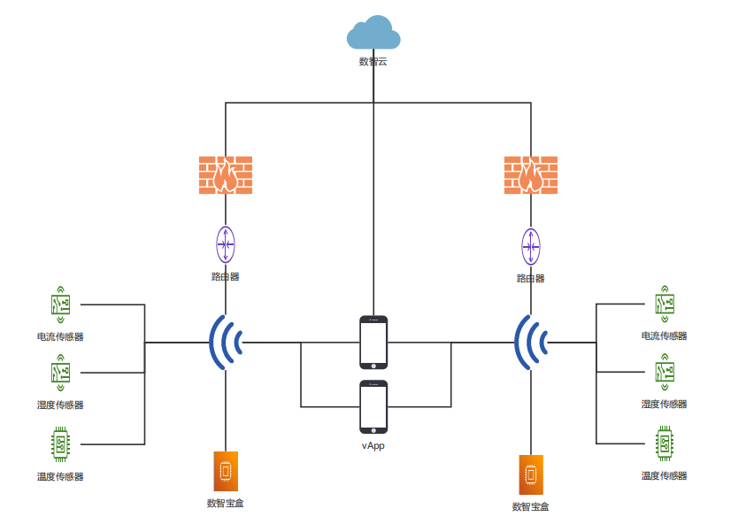
- 平台架构图
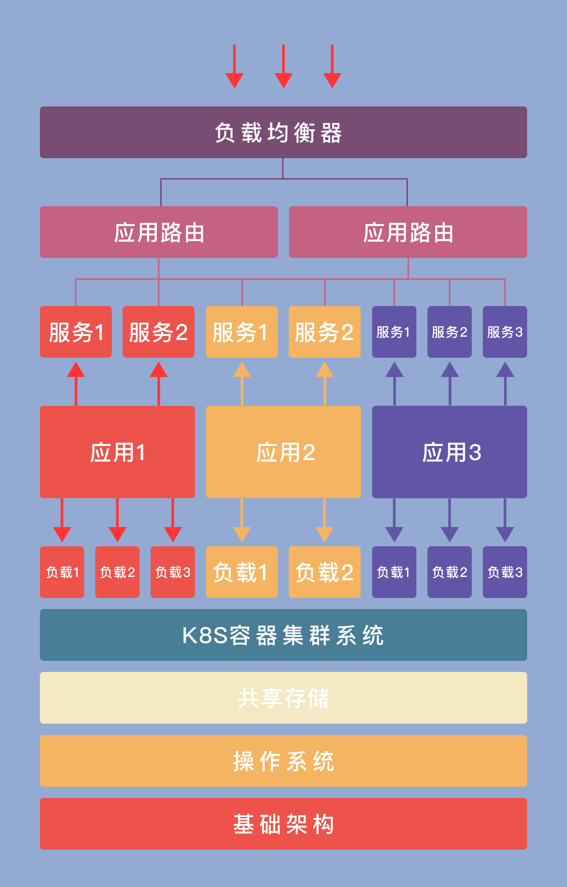

## 数智云优势
- 快速接入
  - 无代码，可视化物联网设备接入
  - 提供行业完整解决方案
- 开放弹性可伸缩架构
  - 基于开放性技术，高可用性，高弹性部署
  - APP自定义开发
- 安全性
  - 支持数据本地存储
  - 企业数据云端加密存储
- 国际化
  - 应用多语言支持
## 数智宝盒
伴随着AI，智能物联，工业4.0等概念的广泛传播和探索应用，面向制造企业，提供数字化智造工厂的综合解决方案的轻资产产品颇受市场和投资青睐。配合公司整体战略方向，5+5+N，第二个5，智运动、智激光、激智云、数智云和云智造。数智宝盒以树莓派为载体，是针对机床电流，车间温度，湿度等数据，通过无线传输，本地存储，边缘计算，流计算，数据统计分析，移动端APP，网页监控查看以及语音控制的智能产品。一方面满足客户对机床使用率的监控，以及对机床的移动控制，一方面方便我们跟踪客户机床信息，增加客户粘性，最重要的以此为机智云-数智云的起点，积累工业数据，挖掘数据价值，布局工业物联网。 
## 数智xMES
_支持设备物联的本地化开放式制造执行系统_
### MES介绍
- MES是处于计划层和现场自动化系统之间的执行层，主要负责车间生产，管理和调度执行,是一个面向车间层的生产管理技术与实时信息系统。
- 适用于各种制造型企业，能够为用户提供一个快速反应、有弹性、精细化的制造业环境，帮助企业减低成本、按期交货、提高产品质量和提高服务质量。
- 是企业信息集成的纽带，是实施企业敏捷制造战略和实现车间生产敏捷化的基本技术手段。
- 为企业迈进 “工业4.0/中国制造2025” 打下坚实的基础。
  
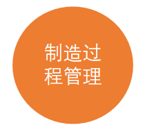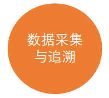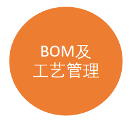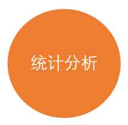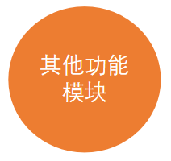
### 产品特点
- 提供多样化的现场监控手段
以人、机、料、法、环为核心的生产管理系统，可以查看工作中心生产状态，对工单进行操作，也可以查看工件所有加工数据。分析问题所在。 支持云、边部署，PAD、PC、手机等多终端使用，与CNC设备无缝交互。
- 灵活的数据收集方式
可以无侵入式采集任意机床的工作电流，环境温度、湿度参数，以及现场视频监控，可以与嘉强CNC数控机床无缝通讯，采集各种数据等。
- 完整的产品及工艺流程定义
通过配置生产资源、定义产品和工艺，来灵活实现生产现场管理要求，每个产品类型有完整的工艺流程，可独立修改设置。
- 支持多国语言
支持中文、英文等多语种，方便企业内不同员工和客户使用。
- 可集成、可扩展的开放式软件架构
系统采用组件化开发模式研发，其灵活的应用方式，可以满足制造企业现场管理的各种需要，同时能够实现系统的可持续化进步。
- 基于微服务的系统结构
遵从ISA95规范，具有良好的可扩展性。

### 功能界面
- 应用
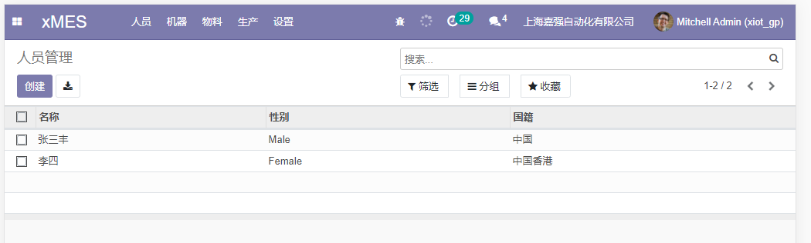
- 制造单
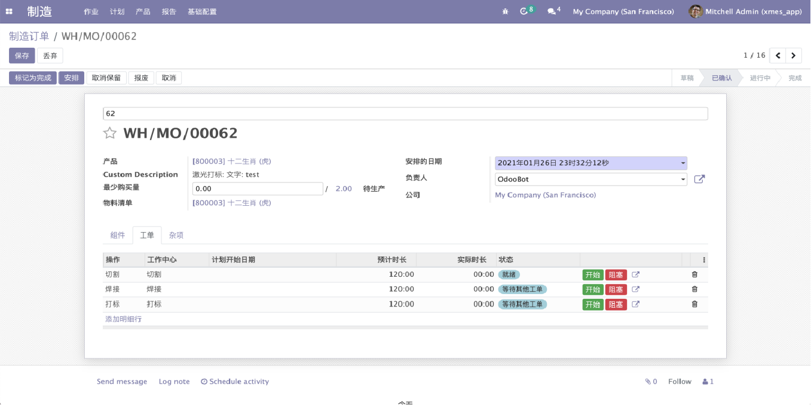
- BOM 物料清单
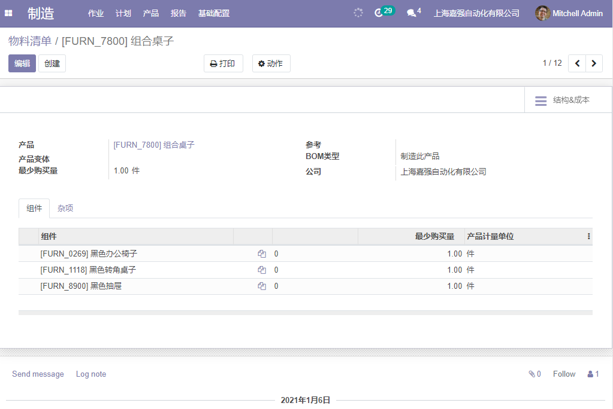
- 工艺路线
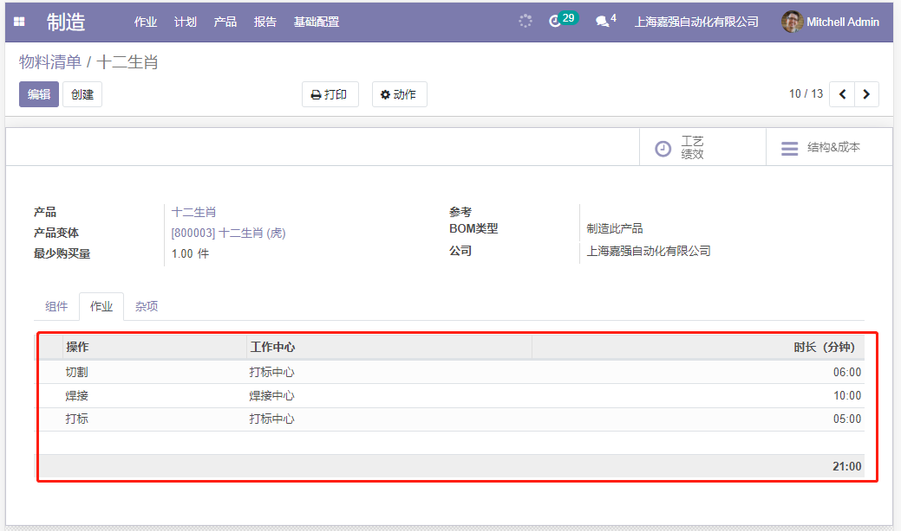
- 现场平板PAD操作
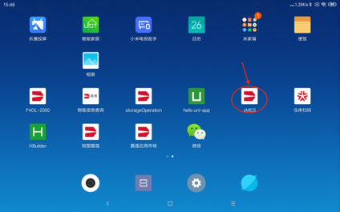
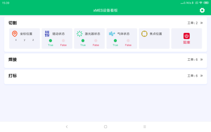
- 现场拍照和工艺图纸
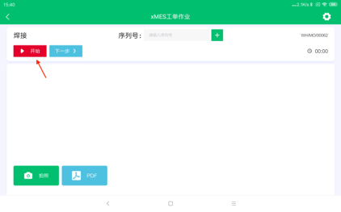
- 设备监控APPV
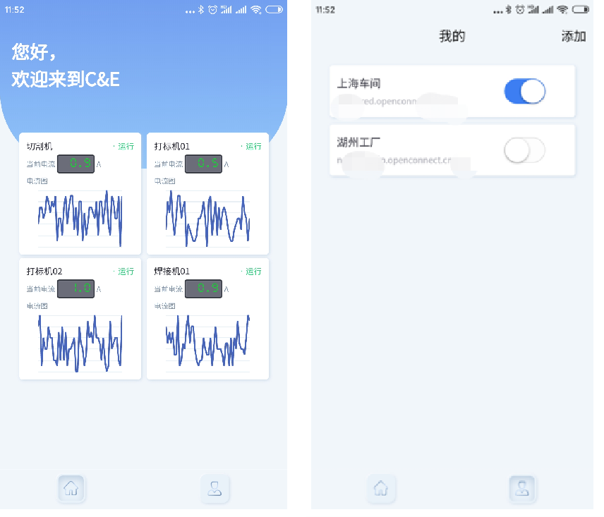
<!-- 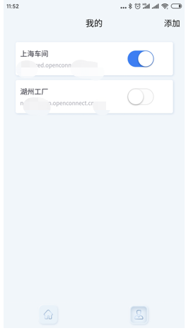 -->
- 追溯报告
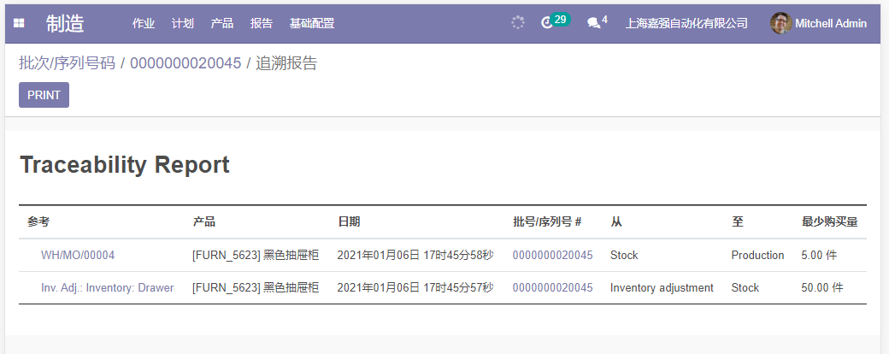
- 钢瓶行业版
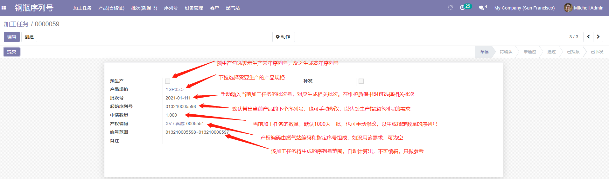
- 序列号/质保书
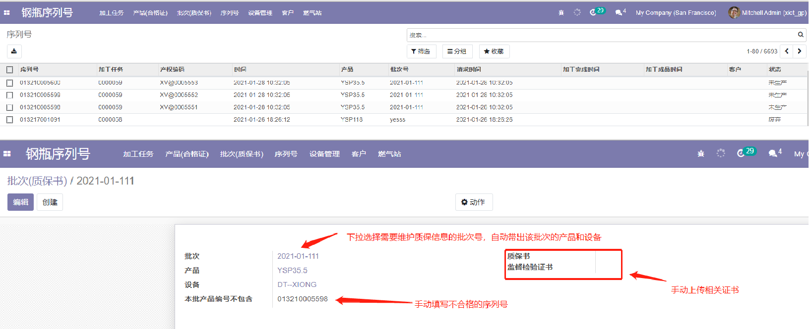
- 合格证电子版
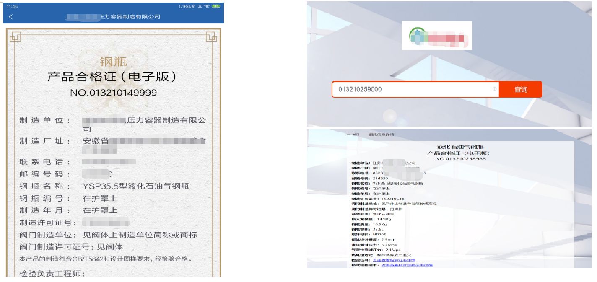

